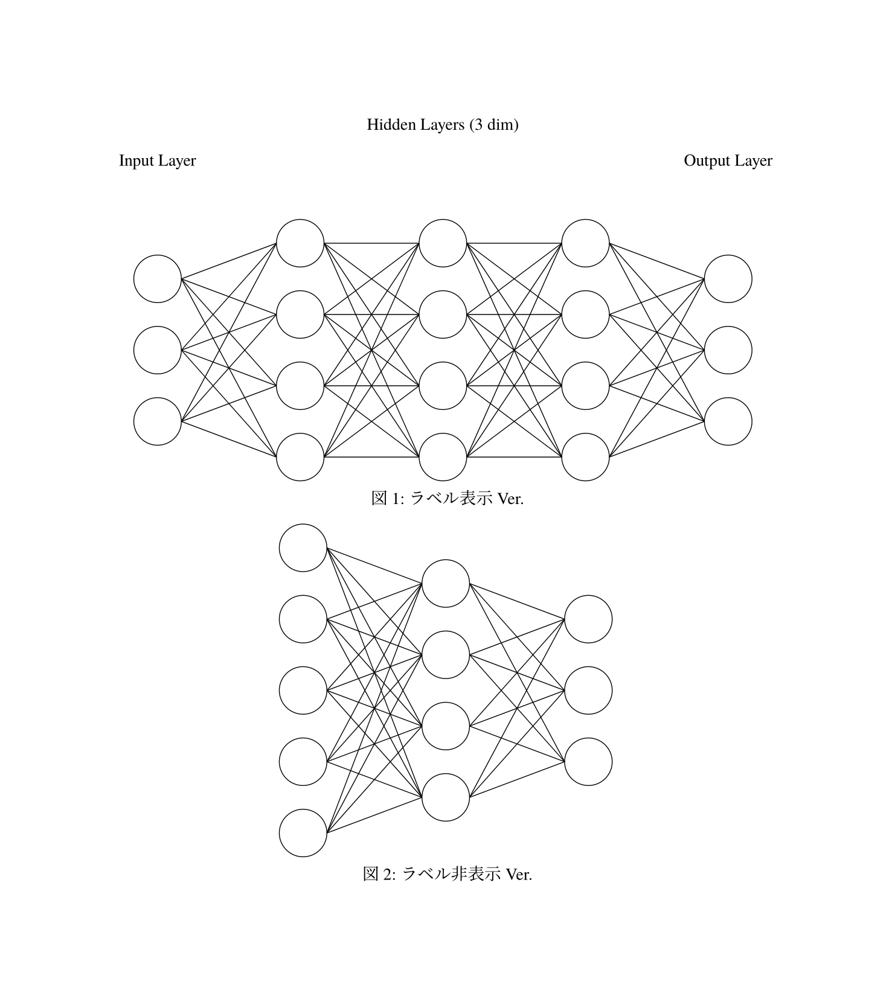

# ニューラルネットワーク描画パッケージ (CeTZ)

## Installation

1. `git clone` する.

```bash
$ git colne https://github.com/rice8y/cetzuron.git
$ cd cetzuron
```

2. `justfile` か `shell` でローカルにパッケージをインストールする.

2-1. `justfile` の場合

```bash
$ just install
```

<details>
<summary>WSL2 での実行例</summary>

2-2. `bash` の場合

```bash
$ just install
Package cetzuron version 0.1.0 has been installed to /home/rice8/.local/share/typst/packages/local/cetzuron/0.1.0
```

</details>


```bash
$ chmod +x init.sh
$ ./init.sh
```

<details>
<summary>WSL2 での実行例</summary>

```bash
$ ./init.sh
Package cetzuron version 0.1.0 has been installed to /home/rice8/.local/share/typst/packages/local/cetzuron/0.1.0
```

</details>

## Usage

### 1. 全結合型ニューラルネットワーク `#fcnn`

#### Parameters

```typ
fcnn(
    inputNodes: int, 
    middleNodes: int, 
    outputNodes: int, 
    middleLayers: int,
    label: bool,
) -> content
```

**inputNodes:** 入力層のノード数  
**middleNodes:** 隠れ層のノード数  
**outputNodes:** 出力層のノード数  
**middleLayers:** 隠れ層の層数 (default: 3)  
**label:** ラベルの有無 (default: true)

#### `#fcnn` の使用例

```typ
#import "@local/cetzuron:0.1.0": *
#set page(width: auto, height: auto)
#set text(lang: "ja", font: "TeX Gyre Termes", size: 10pt)
#show regex("[\p{scx:Han}\p{scx:Hira}\p{scx:Kana}]"): set text(lang: "ja", font: "Harano Aji Mincho", size: 10pt)

#figure(
  fcnn(3, 4, 3),
  caption: [ラベル表示 Ver.]
)
#figure(
  fcnn(5, 4, 3, middleLayers: 1, label: false),
  caption: [ラベル非表示 Ver.]
)
```



### 2. 再帰型ニューラルネットワーク `#rnn`

#### Parameters

```typ
rnn(
    inputNodes: int, 
    middleNodes: int, 
    outputNodes: int, 
    middleLayers: int,
    label: bool,
) -> content
```

**inputNodes:** 入力層のノード数  
**middleNodes:** 隠れ層のノード数  
**outputNodes:** 出力層のノード数  
**middleLayers:** 隠れ層の層数 (default: 3)  
**label:** ラベルの有無 (default: true)

#### `#rnn` の使用例

```typ
#import "@local/cetzuron:0.1.0": *
#set page(width: auto, height: auto)
#set text(lang: "ja", font: "TeX Gyre Termes", size: 10pt)
#show regex("[\p{scx:Han}\p{scx:Hira}\p{scx:Kana}]"): set text(lang: "ja", font: "Harano Aji Mincho", size: 10pt)

#figure(
  rnn(3, 4, 3),
  caption: [ラベル表示 Ver.]
)
#figure(
  rnn(5, 4, 3, middleLayers: 1, label: false),
  caption: [ラベル非表示 Ver.]
)
```


### 短・長期記憶 `#lstm`

#### Parameters

```typ
lstm(
    inputNodes: int, 
    middleNodes: int, 
    outputNodes: int, 
    middleLayers: int,
    label: bool,
) -> content
```

**inputNodes:** 入力層のノード数  
**middleNodes:** 隠れ層のノード数  
**outputNodes:** 出力層のノード数  
**middleLayers:** 隠れ層の層数 (default: 3)  
**label:** ラベルの有無 (default: true)

#### `#lstm` の使用例

```typ
#import "@local/cetzuron:0.1.0": *
#set page(width: auto, height: auto)
#set text(lang: "ja", font: "TeX Gyre Termes", size: 10pt)
#show regex("[\p{scx:Han}\p{scx:Hira}\p{scx:Kana}]"): set text(lang: "ja", font: "Harano Aji Mincho", size: 10pt)

#figure(
  lstm(3, 4, 3),
  caption: [ラベル表示 Ver.]
)
#figure(
  lstm(5, 4, 3, middleLayers: 1, label: false),
  caption: [ラベル非表示 Ver.]
)
```


### オートエンコーダ `#ae`

#### Parameters

```typ
ae(
    inputNodes: int, 
    middleNodes: int, 
    style: string,
    label: bool,
) -> content
```

**inputNodes:** 入力層/出力層のノード数  
**middleNodes:** 隠れ層のノード数  
**style:** 隠れ層の形状 \["short", "full"\] (default: "short")  
**label:** ラベルの有無 (default: true)

#### `#ae` の使用例

```typ
#import "@local/cetzuron:0.1.0": *
#set page(width: auto, height: auto)
#set text(lang: "ja", font: "TeX Gyre Termes", size: 10pt)
#show regex("[\p{scx:Han}\p{scx:Hira}\p{scx:Kana}]"): set text(lang: "ja", font: "Harano Aji Mincho", size: 10pt)

#figure(
  ae(5, 3),
  caption: [ラベル表示 Ver. (short)]
)
#figure(
  ae(5, 3, style: "full"),
  caption: [ラベル表示 Ver. (full)]
)
#figure(
  ae(4, 2, style: "full", label: false),
  caption: [ラベル非表示 Ver. (full)]
)
```


